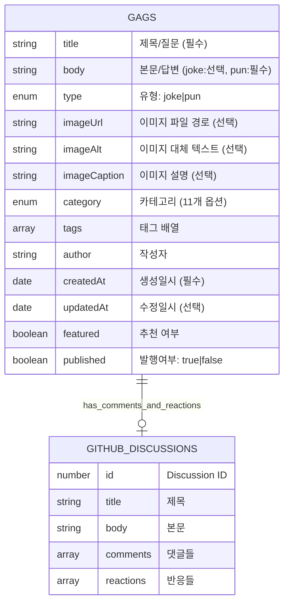

# 아재달레 스키마 리뷰 및 ERD

## 📊 Entity Relationship Diagram (Final)



## 📋 엔티티별 설명

### GAGS (개그 콘텐츠)

- **주 엔티티**: 모든 유형의 개그를 저장
- **type**: `joke` (일반 개그) 또는 `pun` (말장난/아재개그)
- **이미지**: 로컬 파일 경로로 참조 (`./images/example.png`)
- **GitHub Discussion**: 댓글과 반응을 위해 1:1 매핑

#### 타입별 필드 의미:

- **joke**:
  - `title`: 제목
  - `body`: 본문 (선택 - 제목만으로도 개그 성립 가능)
- **pun**:
  - `title`: 질문
  - `body`: 답변 (필수)

### GITHUB_DISCUSSIONS (외부 시스템)

- **용도**: 댓글과 반응 저장
- **관계**: 각 개그당 하나의 Discussion
- **특징**: GitHub API로 런타임에 접근

### 📁 이미지 파일 구조 (파일 시스템)

```
src/
├── content/
│   └── gags/
│       ├── 2024-01-01-title.json
│       └── images/
│           ├── 2024-01-01-title.png      # 개그 전용 이미지
│           └── drake-meme-template.png   # 재사용 템플릿
└── assets/
    └── images/
        └── common/                       # 사이트 공통 이미지
            └── logo.png
```

### 🎯 단순화된 접근법

- **ASSETS 엔티티 제거**: 복잡도 감소
- **이미지는 단순 파일 참조**: `imagePath` 필드로 관리
- **재사용**: 같은 이미지 경로를 여러 개그에서 참조 가능
- **Git LFS**: 대용량 이미지 파일 관리

## 🔍 스키마 분석

### 장점

1. **유연한 콘텐츠 형식**
   - `format` 필드로 다양한 형식 지원 (text, qa, meme, mixed)
   - 조건부 필드로 각 형식에 맞는 데이터 저장

2. **확장 가능한 카테고리 시스템**
   - enum으로 타입 안전성 보장
   - 한국 개발자 문화 특화 카테고리 포함

3. **버전 관리 및 발행 여부**
   - createdAt/updatedAt으로 히스토리 추적
   - published로 콘텐츠 발행 여부 관리

4. **GitHub Discussions 연동 준비**

### 개선 제안

#### 1. 스키마 중복 제거

현재 `gags`와 `memes`에 중복 필드가 많습니다.

```typescript
// 공통 베이스 스키마
const baseContentSchema = z.object({
  title: z.string(),
  category: z.enum([...]),
  tags: z.array(z.string()).default([]),
  author: z.string().default('아재달레'),
  createdAt: z.coerce.date(),
  updatedAt: z.coerce.date().optional(),
  featured: z.boolean().default(false),
  published: z.boolean().default(true)
});

// gags는 베이스 확장
const gagSchema = baseContentSchema.extend({
  body: z.string().optional(),
  format: z.enum(['text', 'qa', 'meme', 'mixed']).default('text'),
  // ... gag 특화 필드
});
```

#### 2. 통합 컬렉션 고려

`gags`와 `memes`를 하나의 `contents` 컬렉션으로 통합:

```typescript
const contentSchema = z.object({
  type: z.enum(["gag", "meme"]), // 최상위 구분
  format: z.enum(["text", "qa", "image", "mixed"]),
  // ... 모든 필드
});
```

#### 3. 필드 일관성 개선

**문제점:**

- `gags`의 `format: meme`와 별도 `memes` 컬렉션이 혼란
- `imageUrl`이 optional인데 `memes`에서는 필수

**제안:**

```typescript
// format 명확화
format: z.enum(["text", "qa", "text-with-image", "image-only"])

  // 조건부 검증
  .refine((data) => {
    if (data.format === "qa") return data.question && data.answer;
    if (data.format === "image-only") return data.imageUrl;
    return true;
  });
```

#### 4. 메타데이터 확장

```typescript
// SEO 및 소셜 공유용
seo: z.object({
  description: z.string().optional(),
  keywords: z.array(z.string()).optional(),
  ogImage: z.string().optional()
}).optional(),

// 통계 추적용
stats: z.object({
  viewCount: z.number().default(0),
  shareCount: z.number().default(0),
  likeCount: z.number().default(0)
}).optional()
```

#### 5. 관계 명확화

```typescript
// 연관 콘텐츠
relatedContent: z.array(z.string()).optional(), // 다른 개그 ID들
series: z.string().optional(), // 시리즈물인 경우
```

## 📋 권장 리팩토링 우선순위

1. **높음**: 베이스 스키마 추출로 중복 제거
2. **중간**: format 필드 명확화 및 조건부 검증 추가
3. **낮음**: SEO/통계 메타데이터 추가 (나중에 필요시)

## 🎯 최종 권장 구조

```typescript
// 단일 콘텐츠 컬렉션 사용
const contents = defineCollection({
  type: "data",
  schema: contentSchema.refine(validation),
});

// 타입별 헬퍼 함수
export const getGags = () =>
  getCollection("contents", ({ data }) => data.format !== "image-only");

export const getMemes = () =>
  getCollection(
    "contents",
    ({ data }) =>
      data.format === "image-only" || data.format === "text-with-image",
  );
```

이렇게 하면 더 일관성 있고 유지보수하기 쉬운 구조가 됩니다.
